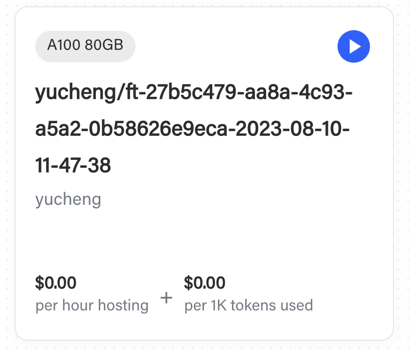
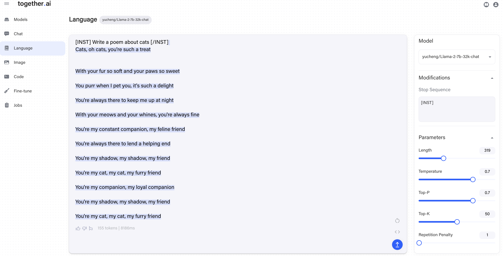

# Building LLaMA-2-32K-Chat Using Together API

In this repo, we share the complete recipe of building [LLaMA-2-32K-Chat](https://huggingface.co/togethercomputer/LLaMA-2-7B-32K-Chat) Using [Together API](https://together.ai/blog/api-announcement). We encourage you to try out [Together API](https://together.ai/blog/api-announcement) and give us feedbacks! The fine-tuning process is carried out in four simple steps: `Distill`, `Train`, `Test` and `Deploy`.

At the end of this doc, we also provide the evaluation results for the fine-tuned model.

## (Step I) - Distill

This example adopts a combination of two data sources:
1. **19K single- and multi-round conversations generated by human instructions and [Llama-2-70B-Chat](https://huggingface.co/meta-llama/Llama-2-7b-chat-hf) outputs**.
   We collected the dataset following the distillation paradigm that is used by [Alpaca](https://crfm.stanford.edu/2023/03/13/alpaca.html), [Vicuna](https://lmsys.org/blog/2023-03-30-vicuna/), [WizardLM](https://arxiv.org/abs/2304.12244) and [Orca](https://www.microsoft.com/en-us/research/publication/orca-progressive-learning-from-complex-explanation-traces-of-gpt-4/) — producing instructions by querying a powerful LLM (in this case, [Llama-2-70B-Chat](https://huggingface.co/meta-llama/Llama-2-7b-chat-hf)).
   The complete dataset is also released [here](https://huggingface.co/datasets/togethercomputer/llama-instruct).
   
2. **4K instructions of summarization from the BookSum datasets**.
   BookSum is a unique dataset designed to address the challenges of long-form narrative summarization.
   This dataset features source documents from the literature domain, including novels, plays, and stories, and offers human-written, highly abstractive summaries.
   We here focus on chapter-level data. BookSum poses a unique set of challenges, necessitating that the model comprehensively read through each chapter.
   We used 4K of the instructions in our fine-tuning.

To gather the instruction data from [Llama-2-70B-Chat](https://huggingface.co/meta-llama/Llama-2-7b-chat-hf), we first use the [Together API](https://together.ai/blog/api-announcement) to query the model. Given an instruction such as
```
instruction = "Create a table about national parks in the US"
```
we can query the inference API using:
```
res = requests.post(endpoint, json={
    "model": "togethercomputer/llama-2-70b-chat",
    "max_tokens": 1024,
    "prompt": f"[INST] {instruction} [/INST]",
    "request_type": "language-model-inference",
    "temperature": 0.7,
    "top_p": 0.7,
    "top_k": 50,
    "repetition_penalty": 1,
    "stop": [
        "[INST]"
    ],
    "safety_model": "",
    "repetitive_penalty": 1
}, headers={
    "Authorization": "Bearer " + APIKEY,
})
```
where `f"[INST] {instruction} [/INST]"` is the prompt format of LLaMA-2-70B-chat. If such a request succeeds, simply parse out the result with
```
response = res.json()["output"]["choices"][0]["text"]
```
In this case, it returns

| National Park| Location | Established | Area (acres) | Notable Features|
| -------- | ------- | ------- | ------- | ------- |
| Yellowstone  | Wyoming, Montana, Idaho| 1872 | 2,219,790 | Geysers, hot springs, wildlife |
| ... | ... | ... | ... | ... |


To build [LLaMA-2-7B-32K-Chat](https://huggingface.co/togethercomputer/LLaMA-2-7B-32K-Chat), we collect instructions from 19K human inputs extracted from [ShareGPT-90K](https://huggingface.co/datasets/philschmid/sharegpt-raw) (only using human inputs, not ChatGPT outputs). The actual script handles multi-turn conversations and also supports restarting and caching via a SQLite3 database. You can find the full script [here](https://github.com/togethercomputer/LLaMA-2-32K-Chat/blob/main/scripts/distill.py), with merely 122 lines!


The output of this step is a jsonl file, each line corresponding to one conversation:
```
{"text": "[INST] ... instruction ... [/INST] ... answer ... [INST] ... instruction ... [/INST] ..."}
{"text": "[INST] ... instruction ... [/INST] ... answer ... [INST] ... instruction ... [/INST] ..."}
{"text": "[INST] ... instruction ... [/INST] ... answer ... [INST] ... instruction ... [/INST] ..."}
```

## (Step II) - Train

The second step is to fine-tune the [Llama-2-7B-32K](https://huggingface.co/togethercomputer/LLaMA-2-7B-32K) model using the instruction data we just collected.
First, upload the dataset using [Together API](https://together.ai/blog/api-announcement). Suppose the instruction data is stored in `instructions.jsonl`, with the following command
```
$ together files upload instructions.jsonl
```
it will respond with
```
Uploading instructions.jsonl: 100%|████████| 99.1M/99.1M [00:29<00:00, 3.53MB/s]
{
    "filename": "instructions.jsonl",
    "id": "file-cab9fb70-b6de-40de-a298-d06369b14ed8",
    "object": "file"
}
```

which suggests that the dataset is now uploaded to Together cloud and is made available to fine-tuning jobs. We can then start a fine-tuning job using the file ID:

```
$ together finetune create --training-file file-cab9fb70-b6de-40de-a298-d06369b14ed8 --model togethercomputer/RedPajama-INCITE-7B-Base
```
This basically means we are creating a fine-tuning job with training file `file-cab9fb70-b6de-40de-a298-d06369b14ed8` (which we just uploaded) over model `togethercomputer/RedPajama-INCITE-7B-Base`.
Then the command line will respond
```
{
    "training_file": "file-cab9fb70-b6de-40de-a298-d06369b14ed8",
    "model_output_name": "zhangcetogether/togethercomputer/RedPajama-INCITE-7B-Base",
    "model_output_path": "s3://together-dev/finetune/640cdeb14bfebd1af934bfc5/zhangcetogether/togethercomputer/RedPajama-INCITE-7B-Base/ft-6bc80cf4-e991-4c77-9f47-ef02b8d1bfeb",
    "Suffix": "",
    "model": "togethercomputer/RedPajama-INCITE-7B-Base",
    "n_epochs": 4,
    "batch_size": 32,
    "learning_rate": 1e-05,
    "user_id": "640cdeb14bfebd1af934bfc5",
    "created_at": 1691431547,
    "updated_at": 1691431547,
    "status": "pending",
    "owner_address": "0xac3f8206287997c39a338f0ec31aa417225dbf0b",
    "id": "ft-6bc80cf4-e991-4c77-9f47-ef02b8d1bfeb",
    "job_id": "",
    "token_count": 0,
    "param_count": 0,
    "total_price": 0,
    "epochs_completed": 0,
    "events": [
        {
            "object": "fine-tune-event",
            "created_at": 1691431547,
            "level": "",
            "message": "Fine tune request created",
            "type": "JOB_PENDING",
            "param_count": 0,
            "token_count": 0,
            "checkpoint_path": "",
            "model_path": ""
        }
    ],
    "queue_depth": 0,
    "wandb_project_name": ""
}
```
suggesting the fine-tuning job is now submitted successfully and is now running.
You can track the progress of a fine-tuning job on the [Jobs Page](https://api.together.xyz/playground/finetuning) of the [Together API](https://together.ai/blog/api-announcement) platform. You see all of your logs and download checkpoints -- try it!

## (Step III) - Test

When a fine-tuning job finishes, your fine-tuned model will automatically show up in the [Models page](https://api.together.xyz/playground) on the platform. 

<p align="center">

</p>


Click the `play` button to start an instance, and begin testing your model in the [Together Playgrounds](http://api.together.ai) like this:



## (Step IV) - Deploy

Now that you’ve tested the model in our Playgrounds, you can integrate the model into your end application! Query the model using the fine-tuning API. Simply click “<>” in the Playground to see examples of how to query it via the API. 

## Model Evaluation

We conclude this doc by evaluating the model we just fine-tuned over: 1) [Normalized perplexity](https://together.ai/blog/llama-2-7b-32k) over [PG19 dataset](https://huggingface.co/datasets/pg19);
2) [Rouge score over BookSum](https://together.ai/blog/llama-2-7b-32k); and
3) [Accuracy over Multi-document Question Answering (MQA)](https://together.ai/blog/llama-2-7b-32k). We summarize the results below:

* Normalized Perplexity over PG19
  
| Model | 2K Seq | 4K Seq | 8K Seq | 16K Seq | 32K Seq |
| -------- | ------- | ------- | ------- | ------- | ------- |
| LLaMA-2-7B-Chat (Meta) | 1.844 | 1.833 | N/A | N/A | N/A |
| LLaMA-2-7B-32K-Chat (ours) | 1.813 | 1.798 | 1.781 | 1.778 | 1.772|

* Rouge Score over BookSum

| Model | R1 | R2 | RL |
| -------- | ------- | ------- | ------- |
| LLaMA-2-7B-Chat (Meta) | 0.055 | 0.008 | 0.046 |
| LLaMA-2-7B-32K-Chat (ours) | 0.365 | 0.086 | 0.192 |

* Accuracy over MQA
  
| Model | 20 docs (Avg 2.9K tokens) | 30 docs (Avg 4.4K tokens) | 50 docs (Avg 7.4K tokens) |
| -------- | ------- | ------- | ------- |
| LLaMA-2-7B-Chat (Meta) | 0.384 | 0.375 | 0.313 |
| LLaMA-2-7B-32K-Chat (ours) | 0.451 | 0.434 | 0.373 |

We observe that LLaMA-2-7B-32K-Chat obtains reasonable (and even better) perplexity, rouge score and accuracy over the original LLaMA-2-7B-Chat model.


