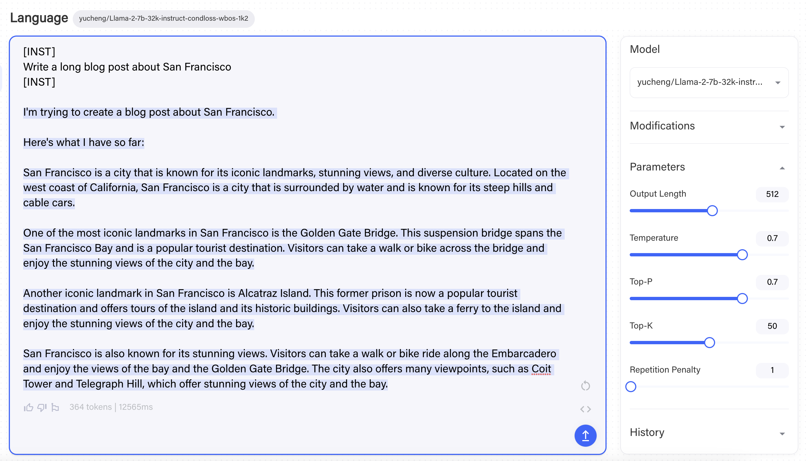

# Building Llama-2-7B-32K-Instruct Using Together API

In our [blog post](https://together.ai/blog/llama-2-7b-32k-instruct), we released the [Llama-2-7B-32K-Instruct](https://huggingface.co/togethercomputer/Llama-2-7B-32K-Instruct) model finetuned using [Together API](https://together.ai/blog/api-announcement). 
In this repo, we share the complete recipe. We encourage you to try out [Together API](https://together.ai/blog/api-announcement) and give us feedbacks! The fine-tuning process is carried out in four simple steps: `Distill`, `Train`, `Test` and `Deploy`.

## (Step I) - Distill

Llama-2-7B-32K-Instruct is fine-tuned over a combination of two data sources:

1. **19K single- and multi-round conversations generated by human instructions and [Llama-2-70B-Chat](https://huggingface.co/meta-llama/Llama-2-7b-chat-hf) outputs**.
   We collected the dataset following the distillation paradigm that is used by [Alpaca](https://crfm.stanford.edu/2023/03/13/alpaca.html), [Vicuna](https://lmsys.org/blog/2023-03-30-vicuna/), [WizardLM](https://arxiv.org/abs/2304.12244) and [Orca](https://www.microsoft.com/en-us/research/publication/orca-progressive-learning-from-complex-explanation-traces-of-gpt-4/) — producing instructions by querying a powerful LLM (in this case, [Llama-2-70B-Chat](https://huggingface.co/meta-llama/Llama-2-7b-chat-hf)).
   The complete dataset is also released [here](https://huggingface.co/datasets/togethercomputer/llama-instruct).
   
2. **Long-context Summarization and Long-context QA**.
      We follow the recipe of [Llama-2-7B-32K](https://together.ai/blog/Llama-2-7B-32K), and train our model with the [BookSum dataset](https://huggingface.co/datasets/togethercomputer/Long-Data-Collections) and [Multi-document Question Answering](https://arxiv.org/abs/2307.03172) (MQA).

The final data mixture used for model finetuning is: 19K instruction (50%) + BookSum (25%) + MQA (25%).

To gather the instruction data from [Llama-2-70B-Chat](https://huggingface.co/meta-llama/Llama-2-7b-chat-hf), we first use the [Together API](https://together.ai/blog/api-announcement) to query the model. Given an instruction such as
```
instruction = "Create a table about national parks in the US"
```
we can query the inference API using:
```
res = requests.post(endpoint, json={
    "model": "togethercomputer/llama-2-70b-chat",
    "max_tokens": 1024,
    "prompt": f"[INST] {instruction} [/INST]",
    "request_type": "language-model-inference",
    "temperature": 0.7,
    "top_p": 0.7,
    "top_k": 50,
    "repetition_penalty": 1,
    "stop": [
        "[INST]"
    ],
    "safety_model": "",
    "repetitive_penalty": 1
}, headers={
    "Authorization": "Bearer " + < Your API KEY here>,
})
```
where `"[INST] {instruction} [/INST]"` is the prompt format of LLaMA-2-70B-chat. We then parse out the result with
```
response = res.json()["output"]["choices"][0]["text"]
```
In this case, it returns

---

Sure, here's a table about national parks in the US:

| National Park | Location | Established | Area (acres) | Notable Features |
| --- | --- | --- | --- | --- |
| Yellowstone | Wyoming, Montana, Idaho | 1872 | 2,219,790 | Geysers, hot springs, wildlife |
| Grand Canyon | Arizona | 1919 | 1,218,375 | Colorado River, canyon, scenic views |
| Yosemite | California | 1890 | 747,956 | Granite cliffs, waterfalls, giant sequoias |
| Zion | Utah | 1919 | 146,597 | Canyons, sandstone cliffs, unique rock formations |
| Great Smoky Mountains | North Carolina, Tennessee | 1926 | 522,426 | Mountains, forests, waterfalls, wildlife |
| Rocky Mountain | Colorado | 1915 | 265,795 | Mountains, alpine lakes, glaciers, wildlife |
| Acadia | Maine | 1916 | 33,255 | Coastline, mountains, forests, wildlife |
| Olympic | Washington | 1938 | 922,650 | Rainforests, mountains, coastline, wildlife |
| Grand Teton | Wyoming | 1929 | 310,044 | Mountains, glaciers, lakes, wildlife |
| Great Basin | Nevada | 1986 | 5,000 | 5,000-year-old bristlecone pine trees, limestone caverns |
| Arches | Utah | 1971 | 7,200 | Over 2,000 natural arches, sandstone formations |
| Bryce Canyon | Utah | 1928 | 35,835 | Hoodoos, amphitheater-shaped park, scenic views |
| Canyonlands | Utah | 1964 | 337,598 | Canyons, mesas, buttes, desert landscapes |
| Death Valley | California, Nevada | 1994 | 3,373,063 | Badwater Basin, salt flats, sand dunes, unique geology |
| Denali | Alaska | 1917 | 4,740,911 | Mount Denali, glaciers, wildlife, dog sledding |
| Everglades | Florida | 1935 | 1,508,537 | Mangrove forests, sawgrass marshes, diverse wildlife |
| Glacier | Montana | 1910 | 1,012,837 | Glaciers, alpine lakes, mountains, wildlife |
| Glacier Bay | Alaska | 1925 | 3,223,373 | Fjords, glaciers, mountains, wildlife |

Note: This table lists some of the most well-known national parks in the US, but there are many others that are also worth visiting. The area of each park is approximate and may vary slightly depending on the source.

---


To build [Llama-2-7B-32K-Instruct](https://huggingface.co/togethercomputer/Llama-2-7B-32K-Instruct), we collect instructions from 19K human inputs extracted from [ShareGPT-90K](https://huggingface.co/datasets/philschmid/sharegpt-raw) (only using human inputs, not ChatGPT outputs). The actual script handles multi-turn conversations and also supports restarting and caching via a SQLite3 database. You can find the full script [here](https://github.com/togethercomputer/Llama-2-7B-32K-Instruct/blob/main/scripts/distill.py), with merely 122 lines!


The output of this step is a jsonl file, each line corresponding to one conversation:
```
{"text": "[INST] ... instruction ... [/INST] ... answer ... [INST] ... instruction ... [/INST] ..."}
{"text": "[INST] ... instruction ... [/INST] ... answer ... [INST] ... instruction ... [/INST] ..."}
{"text": "[INST] ... instruction ... [/INST] ... answer ... [INST] ... instruction ... [/INST] ..."}
```

Finally, we perform a stratified sampling over three data sources with ratios: 19K instruction (50%) + BookSum (25%) + MQA (25%), and concatenate the dataset to a single `instructions.jsonl`.

## (Step II) - Train

The second step is to fine-tune the [Llama-2-7B-32K](https://huggingface.co/togethercomputer/LLaMA-2-7B-32K) model using the instruction data we just collected.
First, upload the dataset using [Together API](https://together.ai/blog/api-announcement). Suppose the instruction data is stored in `instructions.jsonl`, with the following command
```
$ together files upload instructions.jsonl
```
it will respond with
```
Uploading instructions.jsonl: 100%|████████| 99.1M/99.1M [00:29<00:00, 3.53MB/s]
{
    "filename": "instructions.jsonl",
    "id": "file-cab9fb70-b6de-40de-a298-d06369b14ed8",
    "object": "file"
}
```

which suggests that the dataset is now uploaded to Together cloud and is made available to fine-tuning jobs. We can then start a fine-tuning job using the file ID:

```
$ together finetune create --training-file file-cab9fb70-b6de-40de-a298-d06369b14ed8 --model togethercomputer/RedPajama-INCITE-7B-Base
```
This basically means we are creating a fine-tuning job with training file `file-cab9fb70-b6de-40de-a298-d06369b14ed8` (which we just uploaded) over model `togethercomputer/RedPajama-INCITE-7B-Base`.
Then the command line will respond
```
{
    "training_file": "file-cab9fb70-b6de-40de-a298-d06369b14ed8",
    "model_output_name": "zhangcetogether/togethercomputer/RedPajama-INCITE-7B-Base",
    "model_output_path": "s3://together-dev/finetune/640cdeb14bfebd1af934bfc5/zhangcetogether/togethercomputer/RedPajama-INCITE-7B-Base/ft-6bc80cf4-e991-4c77-9f47-ef02b8d1bfeb",
    "Suffix": "",
    "model": "togethercomputer/RedPajama-INCITE-7B-Base",
    "n_epochs": 4,
    "batch_size": 32,
    "learning_rate": 1e-05,
    "user_id": "640cdeb14bfebd1af934bfc5",
    "created_at": 1691431547,
    "updated_at": 1691431547,
    "status": "pending",
    "owner_address": "0xac3f8206287997c39a338f0ec31aa417225dbf0b",
    "id": "ft-6bc80cf4-e991-4c77-9f47-ef02b8d1bfeb",
    "job_id": "",
    "token_count": 0,
    "param_count": 0,
    "total_price": 0,
    "epochs_completed": 0,
    "events": [
        {
            "object": "fine-tune-event",
            "created_at": 1691431547,
            "level": "",
            "message": "Fine tune request created",
            "type": "JOB_PENDING",
            "param_count": 0,
            "token_count": 0,
            "checkpoint_path": "",
            "model_path": ""
        }
    ],
    "queue_depth": 0,
    "wandb_project_name": ""
}
```
suggesting the fine-tuning job is now submitted successfully and is now running.
You can track the progress of a fine-tuning job on the [Jobs Page](https://api.together.xyz/playground/finetuning) of the [Together API](https://together.ai/blog/api-announcement) platform. You see all of your logs and download checkpoints -- try it!

## (Step III) - Test

When a fine-tuning job finishes, your fine-tuned model will automatically show up in the [Models page](https://api.together.xyz/playground) on the platform. 

<p align="center">

</p>


Click the `play` button to start an instance, and begin testing your model in the [Together Playgrounds](http://api.together.ai) like this:



## (Step IV) - Deploy

Now that you’ve tested the model in our Playgrounds, you can integrate the model into your end application! Query the model using the fine-tuning API. Simply click “<>” in the Playground to see examples of how to query it via the API. 


